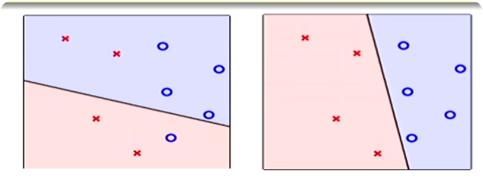
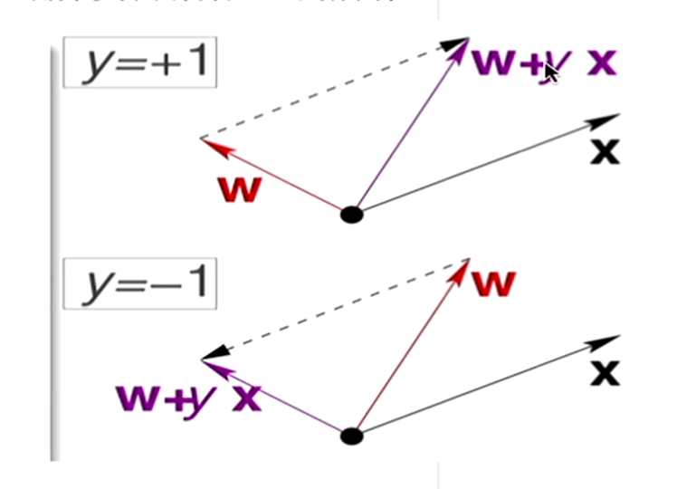

# 机器学习与感知机模型 (Machine Learning & Perceptron Model)

## 1. 机器学习问题的形式化描述

- **目标**：我们希望找到一个理想的决策函数 $f$，但它是未知的。
- **输入**：我们拥有的是一个训练样本集 $D = \{(\mathbf{x}_1, y_1), ..., (\mathbf{x}_N, y_N)\}$。
- **过程**：通过一个学习算法 $\mathcal{A}$，从一个假设集合 $\mathcal{H}$ 中，找到一个最终的假设（决策函数）$g$。
- **期望**：我们希望找到的 $g$ 能够尽可能地接近未知的 $f$，即 $g \approx f$。

## 2. 感知机模型 (Perceptron Model)

感知机是一个经典的二元线性分类模型。以信用卡审批为例：

- **输入特征**：申请者的特征向量 $\mathbf{x} = (x_1, x_2, ..., x_d)$。
- **分数计算**：为每个特征 $x_i$ 分配一个权重 $w_i$，计算总分 $\text{Score} = \sum_{i=1}^{d} w_i x_i$。
- **决策规则**：
  - 如果 $\text{Score} > \text{threshold}$，则批准信用卡（输出 +1）。
  - 如果 $\text{Score} < \text{threshold}$，则拒绝申请（输出 -1）。

### 感知机假设函数 (Hypothesis)

将上述规则写成一个函数：

$$h(\mathbf{x}) = \text{sign}\left( \left(\sum_{i=1}^{d} w_i x_i\right) - \text{threshold} \right)$$

### 数学简化

为了简化表达，我们可以将阈值 $\text{threshold}$ 看作一个特殊的权重 $w_0$。我们引入一个恒为 $+1$ 的特征 $x_0$，并令 $w_0 = -\text{threshold}$。这样，求和就可以从 $i=0$ 开始：

$$h(\mathbf{x}) = \text{sign}\left( \sum_{i=0}^{d} w_i x_i \right)$$

使用向量表示，上式可以写为：

$$h(\mathbf{x}) = \text{sign}(\mathbf{w}^T \mathbf{x})$$

其中 $\mathbf{w}$ 是权重向量，$\mathbf{x}$ 是增广特征向量（包含了 $x_0=1$）。这个公式定义了一条决策边界（在二维空间中是一条直线，在高维空间中是一个超平面）。

## 3. 感知机学习算法 (Perceptron Learning Algorithm, PLA)

PLA 的思想是"知错能改"。

### 算法流程

1. 从一个初始的权重向量 $\mathbf{w}_0$ 开始（例如，全零向量）。
2. 在训练数据中找到一个被当前 $\mathbf{w}_t$ **错误分类** 的样本 $(\mathbf{x}_n, y_n)$，即 $\text{sign}(\mathbf{w}_t^T \mathbf{x}_n) \neq y_n$。
3. 根据这个错误来修正权重，更新规则如下：
   $$\mathbf{w}_{t+1} \leftarrow \mathbf{w}_t + y_n \mathbf{x}_n$$
4. 重复步骤 2 和 3，直到在训练集上找不到任何错误分类的样本为止。

### PLA的局限

PLA只在数据是**线性可分 (linearly separable)** 的情况下才能保证停止。如果数据本身无法用一条直线完美分开（存在噪声），算法将永远不会停止。

## 4. 口袋算法 (Pocket Algorithm)

为了解决 PLA 在非线性可分数据上的问题，我们引入口袋算法。

### 核心思想

在迭代过程中，始终"口袋"里装着一个当前见过的最好的权重向量 $\hat{\mathbf{w}}$。

### 算法流程

1. 初始化 $\mathbf{w}_0$，并将当前错误率最低的权重 $\hat{\mathbf{w}}$ 设为 $\mathbf{w}_0$。
2. 像 PLA 一样，随机找一个错分点并更新 $\mathbf{w}_t$ 得到 $\mathbf{w}_{t+1}$。
3. 比较 $\mathbf{w}_{t+1}$ 在整个训练集上的错误率与 $\hat{\mathbf{w}}$ 的错误率。
4. 如果 $\mathbf{w}_{t+1}$ 的表现更好（错误更少），就用它替换掉口袋里的 $\hat{\mathbf{w}}$。
5. 经过足够多的迭代次数后，返回口袋里的 $\hat{\mathbf{w}}$ 作为最终结果。
